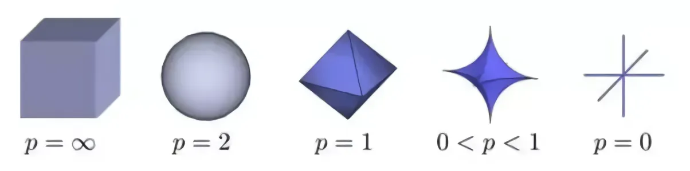

## D2L
**Chapters:** 2.3.8-2.4
### 2.3 Linear Algebra
  * Matrix multiplication
  * Norm 
    ```
    When training a machine learning model to simulate the pattern of our data, we use a loss function to quantify error and guide the model's learning direction. To prevent the model from learning the noise in the training data, a problem known as overfitting, we introduce regularization.
    
    Regularization applies a penalty to the complexity of the model, often by adding a norm of the model's weights to the loss function. The L1 norm is specifically chosen when the goal is to enforce sparsity. Sparsity means forcing many of the model's weights to become exactly zero, effectively removing those features or connections from the model.
    
    This property stems from the L1 norm's geometric shape, which is a diamond (or an octahedron in higher dimensions). When this diamond-shaped constraint intersects with the circular/elliptical contour lines of the loss function, the intersection point—which represents the optimal solution—is highly likely to occur exactly on an axis. Falling on an axis means one or more weight coefficients are zero, thus achieving sparsity. This is especially useful when you have many features but suspect only a few are truly important.
    ```
    * Geometric representation
  
### 2.4 Calculus
  * Derivatives and Differentiation
    * Surrogate Loss Functions when function is not differentiable.
    * Example: Accuracy $A(w) = \mathbb{I}(p(w) > 0.5)$ is not differentiable. Use $L = - \log(p)$ as surrogate.
  * Gradient: the vector of the partial derivatives of a multivariate function
    * $$ \nabla_{\mathbf{x}} f(\mathbf{x}) = [\partial_{x_1} f(\mathbf{x}), \partial_{x_2} f(\mathbf{x}), \dots \partial_{x_n} f(\mathbf{x})]^\top $$
    * $$ \nabla_{\mathbf{x}} \mathbf{Ax} = \mathbf{A}^\top $$
    * $$ \nabla_{\mathbf{x}} \mathbf{x}^\top \mathbf{A} = \mathbf{A} $$
    * $$ \nabla_{\mathbf{x}} \mathbf{x}^\top \mathbf{A} \mathbf{x} = (\mathbf{A} + \mathbf{A}^\top)\mathbf{x} $$
    * $$ \nabla_{\mathbf{x}} \|\mathbf{x}\|^2 = \nabla_{\mathbf{x}} \mathbf{x}^\top \mathbf{x} = 2\mathbf{x} $$
  * Chain rule, for $ y = f(g(x)), y = f(u), u = g(x)$ are differentiable, we have
    * $$ \frac{dy}{dx} = \frac{dy}{du} \frac{du}{dx} $$
    * $$ \frac{\partial y}{\partial x_i} = \frac{\partial y}{\partial u_1} \frac{\partial u_1}{\partial x_i} + \frac{\partial y}{\partial u_2} \frac{\partial u_2}{\partial x_i} + \dots + \frac{\partial y}{\partial u_m} \frac{\partial u_m}{\partial x_i} \quad$$
    * $$ \quad \nabla_{\mathbf{x}} y = \mathbf{A} \nabla_{\mathbf{u}} y $$
  * [Exercise](Exercise2.4.6.md)

## Others
  * LaTeX cheatsheet: https://quickref.me/latex.html